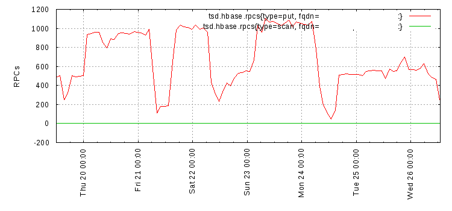

GUI
===

Currently OpenTSDB offers a simple built-in GUI accessible by opening your browser and navigating to the host and port where the TSD is running. For example, if you are running a TSD on your local computer on port 4242, simply navigate to ``http://localhost:4242``. While the GUI won't win awards for beauty, it provides a quick means of building a useful graph with the data in your system.

Interface
^^^^^^^^^

.. image:: ../../images/gui_sections.jpg

There are three main areas of the GUI:

#. The notification area and tab area that serves as a menu
#. The query builder that lets you select what will be displayed and how
#. The graph area that displays query results

Menu
----

The menu is a group of tabs that can be clicked for different options.

* Graph - This is the default that lets you issue a query and generate a graph
* Stats - This tab will display a list of statistics about the running TSD. The same stats can be retrieved via the ``/stats`` or ``/api/stats`` endpoints.
* Logs - If Logback is configured, this tab will show you a list of the latest 1,024 log entries for the TSD.
* Version - Displays version information about the TSD

Errors
------

When building a graph, if an error occurs, a message will appear above the menu.

.. image:: ../../images/gui_error.jpg

Query Builder
^^^^^^^^^^^^^

You'll likely spend a lot of time in this area since there are a number of options to play with. You'll likely want to start by choosing one or more metrics and tags to graph.

.. NOTE:: If you start by picking a start and end time then as soon as you enter a metric, the TSD will start to graph *every time series for that metric*. This will show the ``Loading Graph...`` status and may take a long time before you can do anything else. So skip the times and choose your metrics first.

.. NOTE:: Also note that changes to any field in this section will cause a graph reload, so be aware if you're graph takes a long time to load.

Metrics Section
---------------

.. image:: ../../images/gui_metric_section.jpg

This area is where you choose the metrics, optional tags, aggregation function and a possible down sampler for your graph. Along the top are a pair of blue tabs. Each graph can display multiple metrics and the tabs organize the different sub queries. Each graph requires at least one metric so you'll choose that metric in the first tab. To add another metric to your graph, click the ``+`` tab and you'll be able to setup another sub query. If you have configured multiple metrics, simply click on the tab that corresponds to the metric you want to modify. The tab will display a subset of the metric name it is associated with.

The **Metric** box is where you'll choose a metric. This field auto-completes as you type just like a modern web browser. Auto-complete is case sensitive so only metrics matching the case provided will be displayed. By default, only the 25 top matching entries will be returned so you may not see all of the possible choices as you type. Either click on the entry you want when it appears or keep typing until you have entire metric in the box.

.. image:: ../../images/gui_autocomplete.jpg

Recall from the :doc:`../query/index` documentation that if you only provide a metric without any tags, *every time series with that metric* will be aggregated in the results. If you want to drill down, supply one or more **Tags** to filter or group the results. A new metric section will have two boxes next to **Tags**. The left box is for the tag name or ``tagk`` value, e.g. ``host`` or ``symbol``. The right hand box is for the tag value or ``tagv``, e.g. ``webserver01`` or ``goog``. When you add a tag, another pair of boxes will appear so that you can keep adding tags to filter as much as necessary.

Both tag name and value boxes also auto-complete in the same way as the **Metric** box. However each auto-complete will show *all* of the results for the name or value, not just the values that would apply to a specific metric or tag name. In future versions we may be able to implement such a mapping feature but currently you'll have to sort through all of the values.

The tag value box can use grouping operators such as the ``*`` and the ``|``. See :doc:`../query/index` for details.

The **Rate** box allows you to convert all of the time series for the metric to a rate of change value. By default this option is turned off.

For metrics or time series with different scales, you can select the **Right Axis** check box to add another axis to the right of the graph for the metric's time series. This can make graphs much more readable if the scales differ greatly.

The **Aggregator** box is a drop-down list of aggregation functions used to manipulate the data for multiple time series associated with the sub query. The default aggregator is *sum* but you can choose from a number of other options.

The **Downsample** section is used to reduce the number of data points displayed on the graph. By default, GnuPlot will place a character, such as the ``+`` or ``x`` at each data point of a graph. When the time span is wide and there are many data points, the graph can grow pretty thick and ugly. Use down sampling to reduce the number of points. Simply choose an aggregation function from the drop down list, then enter a time interval in the second box. The interval must follow the relative date format (without the ``-ago`` component). For example, to downsample on an hour, enter ``1h``. See :doc:`../query/dates` for details.

.. figure:: ../../images/gui_downsampling_off.jpg
  
   Downsampling Disabled
   
.. figure:: ../../images/gui_downsampling_on.jpg

   Downsampling Enabled

Time Section
------------

.. image:: ../../images/gui_time.jpg

The time secion determines the timespan for all metrics and time series in your graph. The **Frome** time determines when your graph will start and the **End** time determines when it will stop. Both fields must be filled out for a query to execute. Times may be in human readable, absolute format or a relative format. See :doc:`../query/dates` for details. 

Clicking a time box will pop-up a utility to help you choose a time. Use the arrows at the top left of the box to navigate through the months, then click on a date. The relative links in the upper right are helpers to jump forward or backward 1 minute, 10 minutes, 1 hour, 1 day, 1 week or 30 days. The *now* link will update the time to the current time on your local system. The **HH** buttons let you choose an hour along with *AM* or *PM*. The MM buttons let you choose a normalized minute. You can also cut and paste a time into the any of the boxes or edit the times directly.

.. NOTE:: Unix timestamps are not supported directly in the boxes. You can click in a box to display the calendar, then paste a Unix timestamp (in seconds) in the *UNIX Timestamp* box, then press the *TAB* key to convert to a human readable time stamp. 

If the time stamp in a time box is invalid, the background will turn red. This may happen if your start time is greater than or equal to your end time. 

The **To (now)** link will update the **End** box to the current time on your system. 

Click the **Autoreload** check box to automatically refresh your graph periodically. This can be very useful for monitoring displays where you want to have the graph displayed for a number of people. When checked, the **End** box will disappear and be replaced by an **Every:** box that lets you choose the refresh rate in seconds. The default is to refresh every 15 seconds.

Graphing
^^^^^^^^

We'll make a quick detour here to talk about the actual graph section. Below the query building area is a spot where details about query results are displayed as well as the actual graph. 

.. image:: ../../images/gui_cached.jpg

A status line prints information about the results of a query including whether or not the results were cached in the TSD, how many raw data points were analyzed, how many data points were actually plotted (as per the results of aggregations and down sampling) and how long the query took to execute. When the browser is waiting for the results of a query, this message will show ``Loading Graph...``. 

Below the status line will be the actual graph. The graph is simply a PNG image generated by GnuPlot so you can copy the image and save it to your local machine or send it in an email.

You can also zoom in on a time range by clicking and dragging a red box across a section of the graph. Release and the query will be updated with the new time span. Note that the browser cursor doesn't change when you're over the graph, it will still remain the default arrow your browser or OS provides.

.. image:: ../../images/gui_zoom.jpg

Graph Style
-----------

Back in the query builder section you have the graphing style box to the right.

.. image:: ../../images/gui_graphing_style.jpg

The **WxH** box alters the dimensions of the graph. Simply enter the ``<width>x<height>`` in pixels such as ``1024x768`` then tab or click in another box to update the graph.

Below that are a few tabs for altering different parts of the graph.

Axes Tab
--------

This area deals with altering the Y axes of the graph. **Y** settings affect the axis on the left and **Y2** settings affect the axis on the right. Y2 settings are only enabled if at least one of the metrics has had the **Right Axis** check box checked.

The **Label** box will add the specified text to the graph alon the left or right Y axis. By default, no label is provided since OpenTSDB doesn't know what you're graphing.

The **Format** box can alter the numbers on the Y axis according to a custom algorithm or formatting. This can be useful to convert numbers to or from scientific notation and adjusting the scale for gigabytes if the data comes in as bytes. For example, you can supply a value of ``%0.0f Reqs`` and it will change the axis to show an integer value at each step with the string *Reqs* after it as in the following example.

.. image:: ../../images/gui_format.png

Read the `GnuPlot Manual <http://www.gnuplot.info/>`_ for *Format Specifiers* to find out what is permissible.

The **Range** box allows you to effectively zoom horizontally, showing only the data points between a range of Y axis values. The format for this box is ``[<starting value>:<optional end value>]``. For example, if I want to show only the data points with values between 700 and 800 I can enter ``[700:800]``. This will produce a graph as below:

.. image:: ../../images/gui_range.png

The **Log Scale** check box will set a base ten log scale on the Y axis. An example appears below.

.. image:: ../../images/gui_log.png

Key Tab
-------

The top half of the key tab's section deals with the location of the graph key. This is a series of buttons layed out to show you where the key will appear. A box surrounds some of the buttons indicating that the key will appear inside of the graph's box, overlaying the data. The default location is the top right inside of the graph box. Simply select a button to move the key box.

.. image:: ../../images/gui_key_above.png

By default, the key lists all of the different labels vertically. The **Horizontal Layout** check box will lay out the key horizontally first, then vertically if the dimensions of the graph wouldn't support it.

The **Box** check box will toggle a box outline around the key. This is on by default.

The **No Key** check box will hide the key altogether.

Style Tab
---------

The style tab currently has a single box, the **Smooth** check box. With this checked, the data point characters will be removed from the graph showing the lines only. Some users prefer this over the default.

Saving Your Work
^^^^^^^^^^^^^^^^

As you make changes via the GUI you'll see that the URL reflects your edits. You can copy the URL, save it or email it around and pull it back up to pick up where you were. Unfortunately OpenTSDB doesn't include a built in dashboard so you'll have to save the URL somewhere manually.